# FarmBazaar

FarmBazaar is an online platform that facilitates the direct sale of farm products from farmers to consumers. Admins can assign products to farmers, who can then list and sell them on the platform. Delivery partners handle order deliveries, ensuring timely and efficient distribution of products to consumers.

## Features

- **Admin Panel**: Admins can assign products to farmers, manage users, product listings, and track orders.
- **Farmer Dashboard**: Farmers can list assigned products, manage product details, and track sales/profit.
- **Order Management**: Delivery partners handle order deliveries, tracking order status and ensuring timely delivery.
- **User Authentication**: Secure user authentication system ensures that only authorized users can access the platform.

## Installation

To run FarmBazaar locally on your machine, follow these steps:

1. **Clone the Repository**: 
   ```bash
   git clone https://github.com/samarthshubham/cdac_farmbazaar.git
   ```

2. **Set Up Backend**:
   - Navigate to the backend directory:
     ```bash
     cd farmbazaar/backend
     ```
   - Configure the backend application properties (e.g., database connection settings) in `src/main/resources/application.properties`.
   - Build and run the Spring Boot application.

3. **Set Up Frontend**:
   - Navigate to the frontend directory:
     ```bash
     cd ../frontend
     ```
   - Install frontend dependencies:
     ```bash
     npm install
     ```
   - Start the frontend development server:
     ```bash
     npm start
     ```

4. **Access the Application**:
   Once the servers are running, access the FarmBazaar application by navigating to `http://localhost:3000` in your web browser.

## Technologies Used

- **Frontend**:
  - React.js
  - HTML/CSS
  - Bootstrap
  
- **Backend**:
  - Spring Boot
  
- **Database**:
  - MySQL

## Screenshots

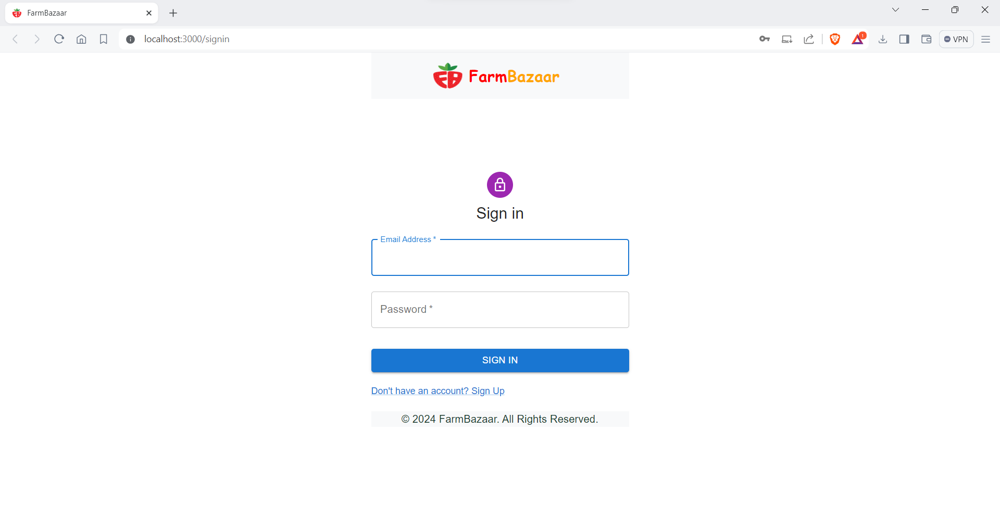
*SignIn*

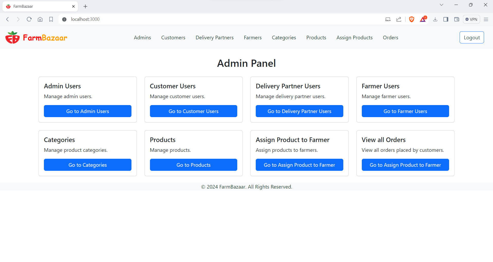
*Admin Panel*

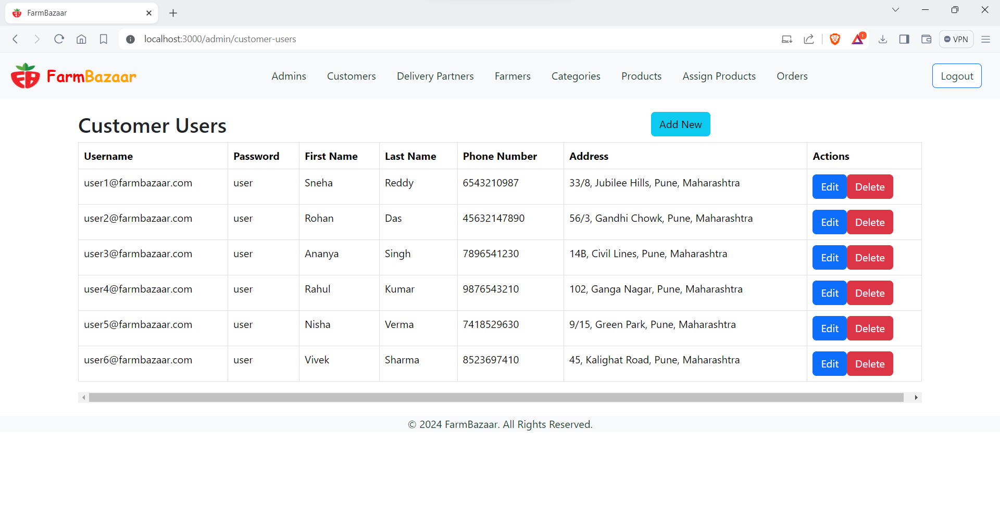
*Customer Users*

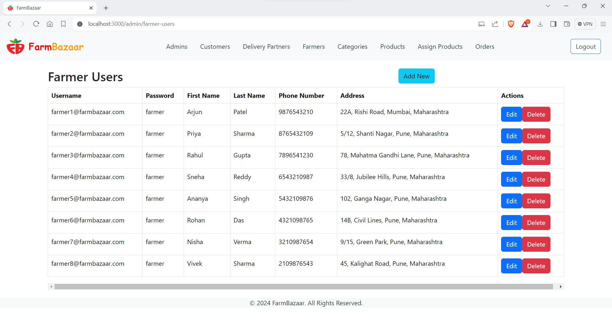
*Farmer Users*

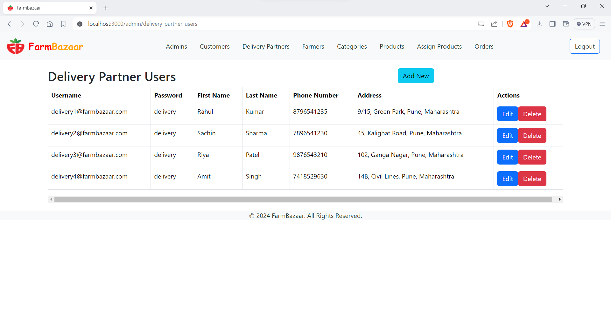
*Delivery Partner Users*

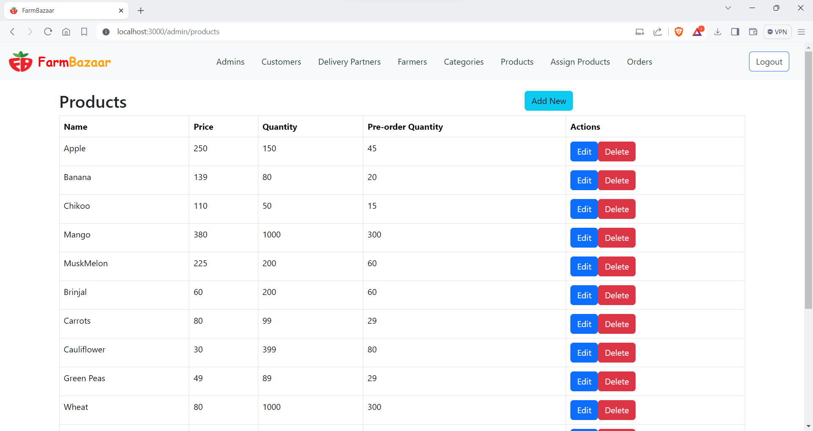
*Products*

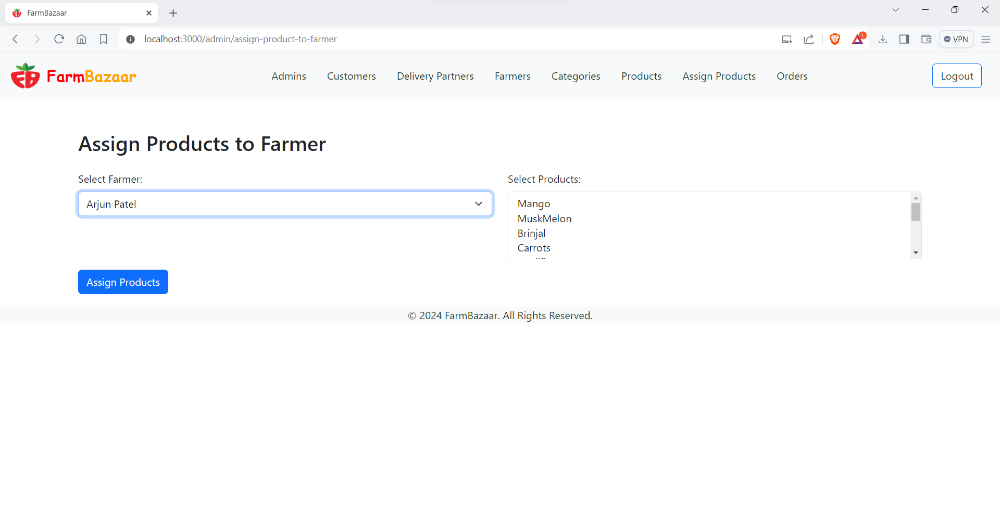
*Assign Products to Farmer*

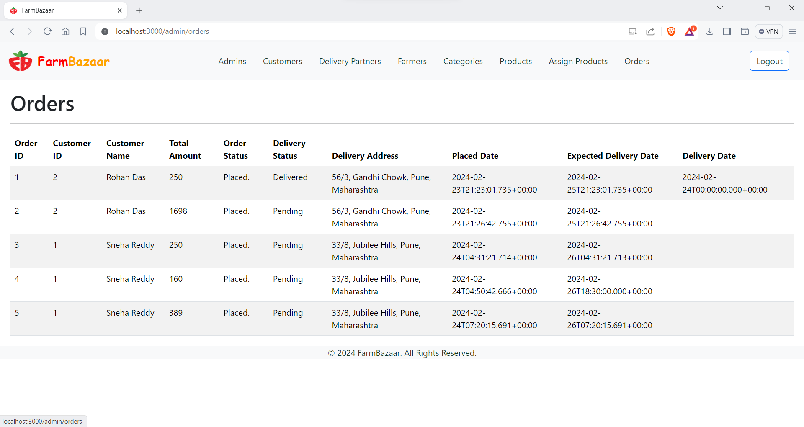
*All orders*

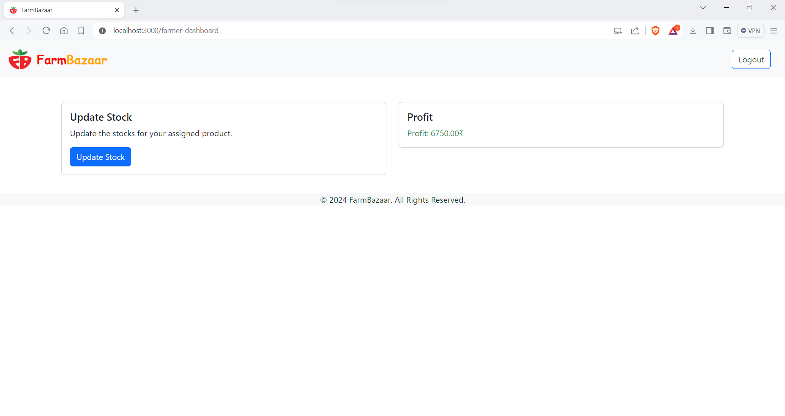
*Farmer Dashboard*

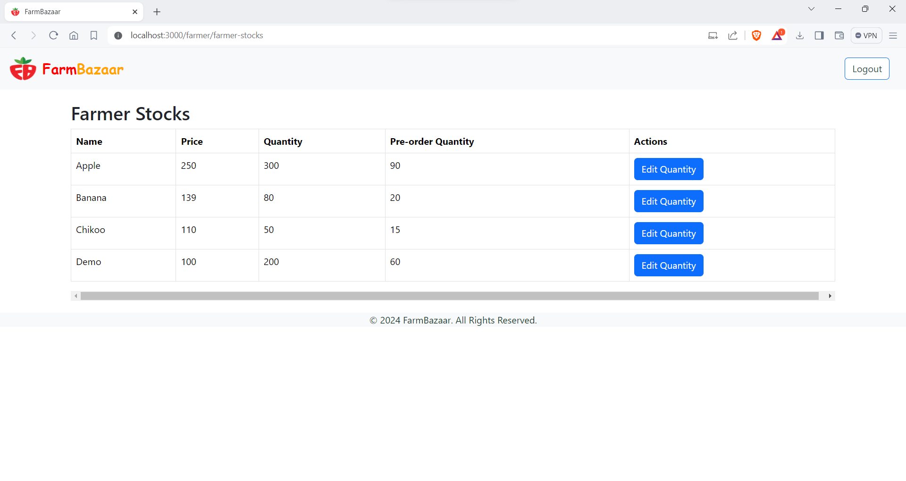
*Add Stocks*

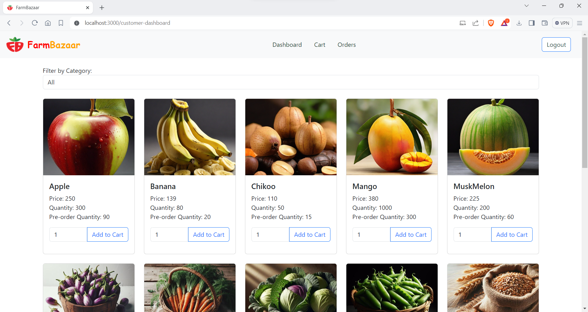
*User (products view)*

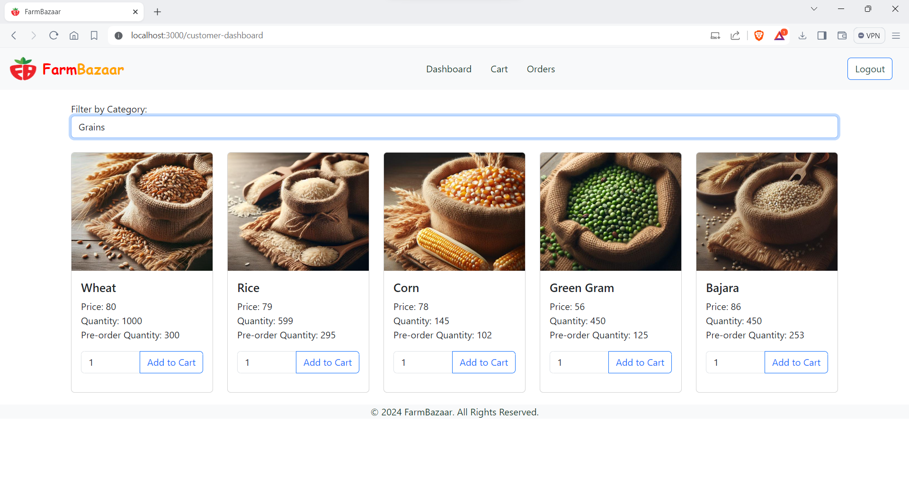
*User (products view by category)*

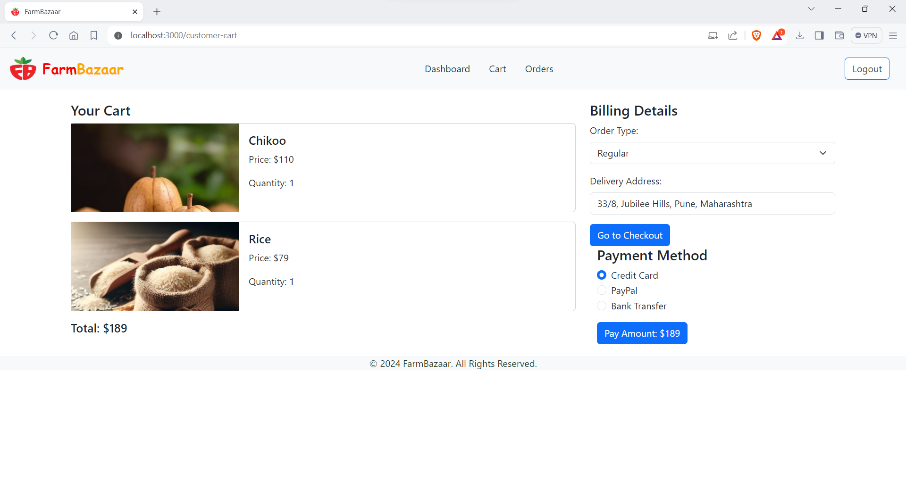
*Cart*

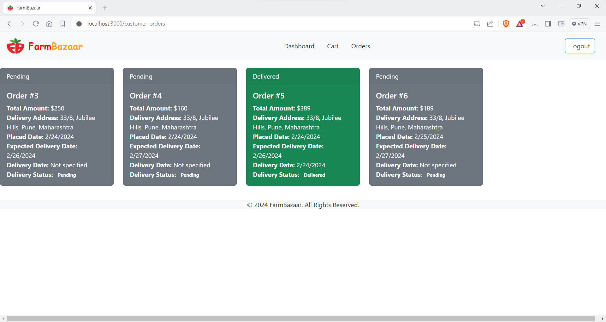
*Orders of user*

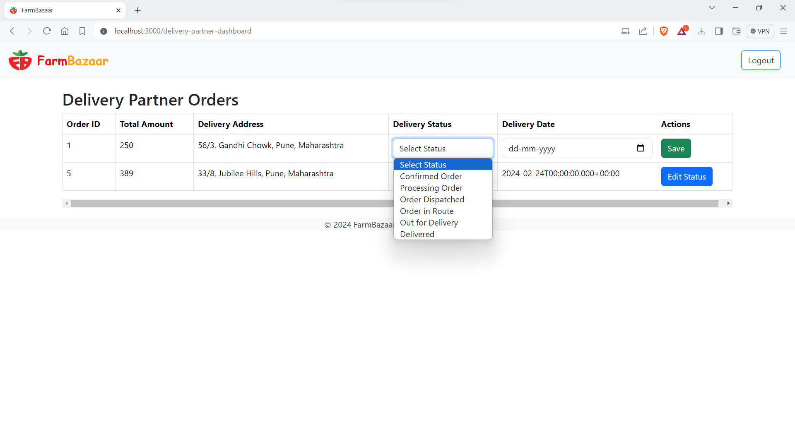
*Delivery Partner Dashboard*


## Contributors

- Shubham Samarth ([@samarthshubham](https://github.com/samarthshubham))
- Mayur Chaudhary ([@iam-mayur](https://github.com/iam-mayur))
- Gaurav Gaikwad ([@gauravgkd](https://github.com/gauravgkd))  
- Nishant Mahajan ([@NISHANT8800](https://github.com/NISHANT8800))

## License

This project is licensed under the MIT License - see the [LICENSE](LICENSE) file for details.
